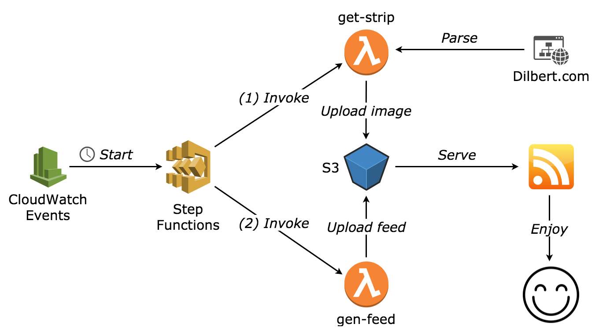

# dilbert-feed

Enjoy [Dilbert](http://dilbert.com/) in your RSS feed reader without any ads!

Unfortunetly, Dilbert's official feed now forces you to go to the website:

> Dilbert readers - Please visit Dilbert.com to read this feature. Due to changes with our feeds, we are now making this RSS feed a link to Dilbert.com.

This serverless application provides a custom feed (updated every day) with direct access to Dilbert comics.

## Architecture



## Usage

Get the comic strip for today:

```console
$ sls invoke -f get-strip
{
    "date": "2018-08-15",
    "title": "How Dilbert Can Help",
    "image_url": "http://assets.amuniversal.com/b813c1e0718901364736005056a9545d",
    "strip_url": "http://dilbert.com/strip/2018-08-15",
    "upload_url": "https://dilbert-feed.s3.eu-central-1.amazonaws.com/strips/2018-08-15.gif"
}
```

Get the comic strip for a specific date:

```console
$ sls invoke -f get-strip -d '{"date":"2016-01-01"}'
{
    "date": "2016-01-01",
    "title": "Forgetting Meetings",
    "image_url": "http://assets.amuniversal.com/1a6be66079e101332131005056a9545d",
    "strip_url": "http://dilbert.com/strip/2016-01-01",
    "upload_url": "https://dilbert-feed.s3.eu-central-1.amazonaws.com/strips/2016-01-01.gif"
}
```

Get the comic strips for the last 30 days:

```console
for i in $(seq 0 30); do date=$(gdate -I -d "today -$i days"); printf "{\"date\":\"%s\"}\n" $date | sls invoke -f get-strip; done
```

Generate the RSS feed:

```console
$ sls invoke -f gen-feed
{
    "feed_url": "https://dilbert-feed.s3.eu-central-1.amazonaws.com/v0/rss.xml"
}
```

## Deployment

```console
make
cd terraform/
terraform init
terraform apply
```
