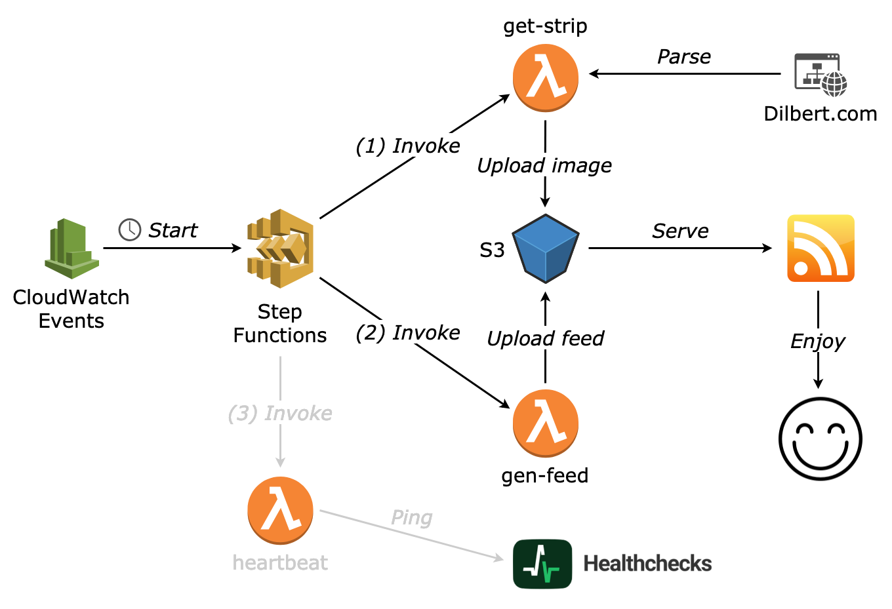

# dilbert-feed

Enjoy [Dilbert](http://dilbert.com/) in your RSS feed reader without any ads!

Unfortunetly, Dilbert's official feed now forces you to go to the website:

> Dilbert readers - Please visit Dilbert.com to read this feature. Due to changes with our feeds, we are now making this RSS feed a link to Dilbert.com.

This serverless application provides a custom feed (updated every day) with direct access to Dilbert comics.

## Architecture



## Usage

Get the comic strip for today:

```console
$ ./invoke dilbert-feed-prod-get-strip
{
  "date": "2019-10-22",
  "title": "Best Employees",
  "image_url": "https://assets.amuniversal.com/87b83e10c7460137c2df005056a9545d",
  "strip_url": "http://dilbert.com/strip/2019-10-22",
  "upload_url": "https://dilbert-feed.s3.eu-central-1.amazonaws.com/strips/2019-10-22.gif"
}
```

Get the comic strip for a specific date:

```console
$ ./invoke dilbert-feed-prod-get-strip --payload '{"date":"2016-01-01"}'
{
  "date": "2016-01-01",
  "title": "Forgetting Meetings",
  "image_url": "https://assets.amuniversal.com/1a6be66079e101332131005056a9545d",
  "strip_url": "http://dilbert.com/strip/2016-01-01",
  "upload_url": "https://dilbert-feed.s3.eu-central-1.amazonaws.com/strips/2016-01-01.gif"
}
```

Get the comic strips for the last 30 days:

```console
for i in $(seq 0 30); do date=$(gdate -I -d "today -$i days"); ./invoke dilbert-feed-prod-get-strip --payload "{\"date\":\"$date\"}"; done
```

Generate the RSS feed:

```console
$ ./invoke dilbert-feed-prod-gen-feed
{
  "feed_url": "https://dilbert-feed.s3.eu-central-1.amazonaws.com/v1/rss.xml"
}
```

## Deployment

Install Go and the [AWS CDK](https://docs.aws.amazon.com/cdk/index.html).

Then run:

```console
make bootstrap
make [dev|prod]
```
